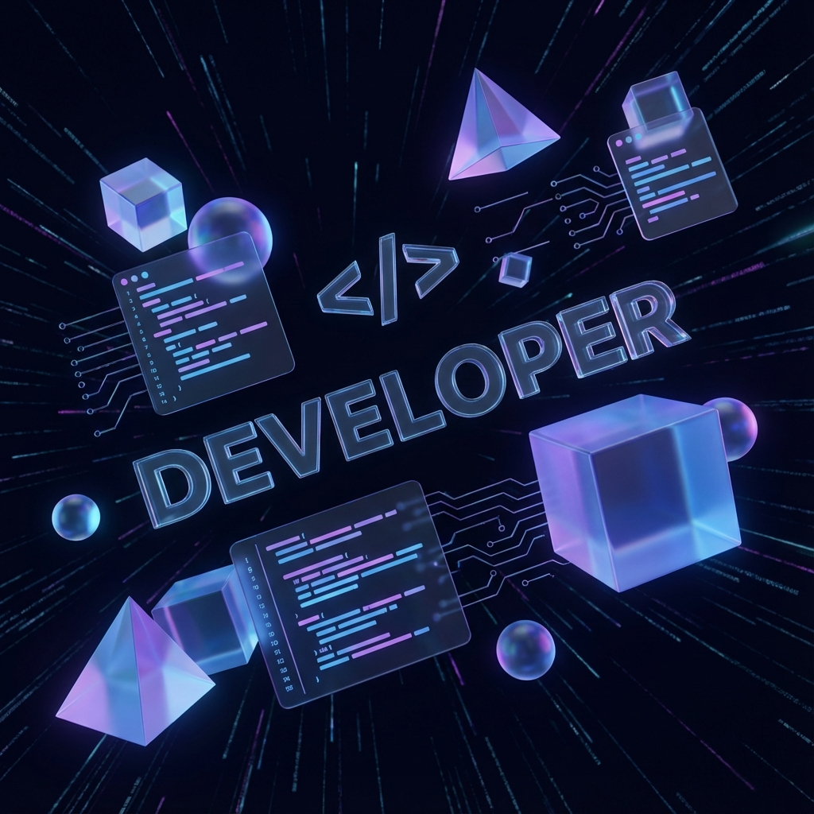

    

 

  <h1 style="font-size: 3em; color: #fff; text-shadow: 0 0 10px #00FFFF;">Hi there, I am Sarmad Ahmed ✨</h1>
  <h3>🚀 IT Engineer | Flutter Developer | Web Developer</h3>
  
  

    Building immersive mobile experiences with a touch of spatial magic.
  

   

  <!-- Socials -->
  
  
  <!-- Add LinkedIn or others if available -->

 
 

<!-- Tech Stack -->
<h2 align="center">⚡ Tech Stack ⚡</h2>

    
    
    
    
    
    
    
    
    
    
    
    
    

 
 

<!-- Spatial Stats Grid -->

    <table>
        <tr>
            <td align="center" style="background-color: transparent; border: none;">
                
            </td>
            <td align="center" style="background-color: transparent; border: none;">
                
            </td>
        </tr>
    </table>

 

<!-- Floating 3D Element/Gif -->

    

 
 

  

